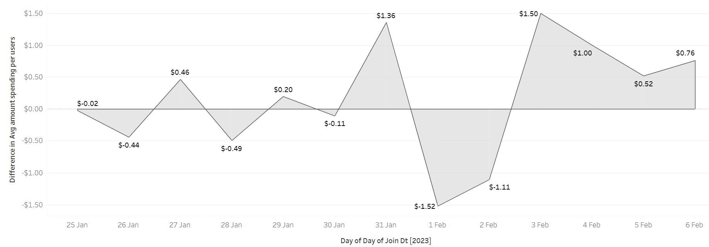

# A-B-Test-Analysis

## Introduction 
#### GloBox - An online marketplace specializing in sourcing unique and high-quality products from around the world. GloBox is primarily known amongst its customer base for boutique fashion items and high-end decor products. However, their food and drink offerings have grown tremendously in the last few months, and the company wants to bring awareness to this product category to increase revenue. The company wants to include a banner that highlights key products in the food and drink category at the top of the website. 

----

## Problem Statement
#### The company want to see the impact of the newly included Banner. And an A/B test was identified suitable to see the effect of the new banner. The control group does not see the banner, but the test group sees it as shown above. Users visiting the GloBox website are randomly assigned to the control and treatment groups/web pages.
- The page loads the banner if the user is assigned to the test group, and does not load the banner if the user is assigned to the control group.
- The user subsequently may or may not purchase products from the website. It could be on the same day they join the experiment, or days later. If they do make one or more purchases, this is considered a “conversion”.

### Identified aims:
- Conduct a hypothesis test to see whether there is a difference in the conversion rate between the two groups. What are the resulting p-value and conclusion?
- What is the 95% confidence interval for the difference in the conversion rate between the treatment and control (treatment-control)?
Use the normal distribution and unpooled proportions for the standard error.
- Conduct a hypothesis test to see whether there is a difference in the average amount spent per user between the two groups. What are the resulting p-value and conclusion?
Use the t distribution and a 5% significance level. Assume unequal variance.
- What is the 95% confidence interval for the difference in the average amount spent per user between the treatment and the control (treatment-control)?
- Visualize the Confidence Intervals
- Check for Novelty effect
- Power Analysis
- Recommendation Options
-  Launch the experiment - If there is improvement in metrics and if the perceived cost of launching the feature is worth the benefits that we saw in the A/B test.
-  Do not launch the experiment - If we didn’t see enough improvement in our metrics of success, so it’s not a good idea to release the banner to all users.
-  Continue iterating - If we didn’t see enough improvement in our success metrics to be confident in releasing the feature in its current state. However, perhaps there were some promising results that show we could possibly make changes to the banner experience and get better improvement next time. Maybe we could do some further data analysis to understand this better, or we need a larger sample size to make a confident recommendation.
---
## Skills Demonstarted 
- *SQL* - Extract the user-level aggregated dataset and perform statistical analysis using SQL.
- *Excel and Tableau* - Analyze the A/B test results using statistical methods in spreadsheets and visualizations in Tableau.
- *Reporting* - Create a written report of the A/B test results.
## The Dataset
GloBox stores its data in a relational database and includes the following 3 tables. 
The description of each table and its columns can be found below.
1. users: user demographic information
- id: the user ID
- country: ISO 3166 alpha-3 country code
- gender: the user's gender (M = male, F = female, O = other)
2. groups: user A/B test group assignment
- uid: the user ID
- group: the user’s test group
- join_dt: the date the user joined the test (visited the page)
- device: the device the user visited the page on (I = iOS, A = android)
3. activity: user purchase activity, containing 1 row per day that a user made a purchase
- uid: the user ID
- dt: date of purchase activity
- device: the device type the user purchased on (I = iOS, A = android)
- spent: the purchase amount in USD

## Analysis and Visualisation

#### Conversion rate
Conversion is whether a user has made one or more purchases. There was a 0.7% difference in the conversion rate among the groups. The conversion rate was significantly higher in the treatment group with a p-value of 0.00011 and a 95% CI (0.0035, 0.0107).

Conversion rate            |   CI of the difference in conversion rate
:------------------------: | :-------------------------:
   | 

#### The average amount spent per user
#### The average amount spent per user was higher in the treatment group ($3.39) than in the control group ($3.37). However the measured difference in the average amount of spending between groups was not statistically significant (P-value=0.94 and 95% CI of ($-0.44, $0.47).

Spending            |   CI of the difference in the average spending
:------------------------: | :-------------------------:
   | 

### The distribution of the amount spent per user for each group
#### The distribution for the amount spent per user was heavily right-skewed in both groups. This indicates that the majority of the user who purchased has spent less than $200. The graph indicates that the frequency of spending was highest in the range between $25 to $50 in both groups.

### Relationship between the test metrics and the user’s device
#### In this given sample of users, the average amount spent per user and the conversion rate were considerably higher in iOS users when compared to Android users in both groups of the study 
Relationship between the test metrics and the user’s device |
:------------------------: |
|
* A category of users with an unknown device type which made up about 0.6% of the total sample size was
excluded from the visualization. This was done because that category makes up a very small portion of the
sample and does not give any meaningful insight as well.*

### Relationship between the test metrics and the user’s gender
In this given sample of users, the average amount spent per user and the conversion rate were considerably higher in female users when compared to male and other gender users in both groups of the study. Moreover, among males, both of the metrics were consistently higher in the treatment group when compared to the control groups.

Relationship between the test metrics and the user’s Gender |
:------------------------: |
 |

### Novelty Effect 
The study was conducted over a period of 13 days. Despite the statistically significant difference in the conversion rate among the groups, a visualization plotted to inspect the difference in conversion rate between groups over the period of the study indicate that there is no clear upward or downward trend. Therefore, there is not enough evidence to conclude that there is a novelty effect that was caused by the introduction of the food and drink banner.

 Difference in conversion rate between groups over time|
:------------------------: |
 |

Moreover, the plot (Below) for the difference between groups in the average amount of spending per user was highly fluctuating with no clear upward or downward trend over the period of the study which is similar to the above finding that indicated that there is not enough evidence to conclude that there is a novelty effect that was caused by the introduction of the food and drink banner.

 Difference in Average Spending between groups over time|
:------------------------: |
 |

### Power Analysis
It is also important to test if the used sample size was enough to detect the observed difference between groups with the desired statistical power and significance level. However, based on the calculation we made using the observed difference in means between the groups 93,008 users for each group (i.e., a total sample size of 186,016 assuming equal group sizes), are needed to achieve a power of 80% and a level of significance of 5% (two-sided), for detecting a true difference in means between the control and the treatment group of $0.016. Moreover, A sample size of 38, 400 in each group is required to truly detect a minimum conversion rate difference of 10% at a significance alpha=0.05 and statistical power of 0.8. All this indicates that we do not have enough sample size to truly detect the difference shown in either the conversion rate or average amount spent per user in both groups. 

### Conclusion 
To conclude, although we have seen a statistically significant improvement in the conversion rate of the treatment group this has not materialized into a statistically significant improvement in the average amount of spending and thus revenue of the company. But, more importantly, as our sample size was not large enough to truly detect a difference with the desired statistical power and significance level, it is important to remember that the inferences we can make from the current analysis should be limited. It will therefore be important and sensible to continue iterating and include more users to truly detect a difference between those values. However, despite the limited inferences we can make from this data due to the fact that we do not have enough sample size to truly detect a difference with the desired statistical power and significance level, the observed improvement in conversion rate in the treatment group is promising. And this shows that we could possibly make changes to the banner experience and get better improvement next time.
A join curve visualizing forecast (with 99% prediction interval) shows the cumulative number of users in the experiment at each point in time showing that we may able to achieve the desired sample sizes within the following 2 months.

Cummulative number of users in the experiment over time (predictive)|
:------------------------: |
 |

### Recommendation
Therefore it would have been sensible to continue iterating as more users (sample size) were needed to truly detect the observed difference in the metrics among the groups. It will therefore be important and sensible to continue iterating and include more users to truly detect a difference between those values. However, despite the limited inferences we can make from this data due to the fact that we do not have enough sample size to truly detect a difference with the desired statistical power and significance level, the observed improvement in conversion rate in the treatment group is promising. And this shows that we could possibly make changes to the banner experience and get better improvement next time. 
Furthermore, the banner takes up high-value real estate on the main page, so we should only be comfortable launching it if it leads to a definitive increase in revenue. 
So, for these reasons, I recommend to continue iterating. 

## SQL CODE USED

new file: Globox.sql 

Tableau links: 
Conversion rate: https://public.tableau.com/views/Book11_16885989929060/Conversionratebetweenthetestgroups?:language=en-GB&:display_count=n&:origin=viz_share_link 
Average amount spent per user : 
https://public.tableau.com/views/Book1tgg/Averageamountspentperuser?:language=en-GB&:display_count=n&:origin=viz_share_link 
The distribution of the amount spent per user for each group :
https://public.tableau.com/views/Book1tggghghb/Thedistributionoftheamountspentperuserforeachgroup?:language=en-GB&:display_count=n&:origin=viz_share_link 
relationship between the test metrics and the user’s device:
https://public.tableau.com/views/relationshipbetweenthetestmetricsandtheusersdevice/relationshipbetweenthetestmetricsandtheusersdevice?:language=en-GB&:display_count=n&:origin=viz_share_link 
relationship between the test metrics and the user’s gender:
https://public.tableau.com/views/conhjhjjhkl/Sheet4?:language=en-GB&:display_count=n&:origin=viz_share_link 
Relationship between the test metrics and the user’s region
https://public.tableau.com/views/conhjhjjhkljjffh/Sheet5?:language=en-GB&:display_count=n&:origin=viz_share_link 
https://public.tableau.com/views/conhjhjjhkljjff/Sheet52?:language=en-GB&:display_count=n&:origin=viz_share_link 
95% CI visualization: 
https://public.tableau.com/views/CIAdvanced1/Dashboard2?:language=en-GB&:display_count=n&:origin=viz_share_link 
 
Novelty effect check: 
https://public.tableau.com/views/Book1346_16912624311130/Sheet1?:language=en-GB&:display_count=n&:origin=viz_share_link 

https://public.tableau.com/views/Book2ddddh/Sheet1?:language=en-GB&:display_count=n&:origin=viz_share_link 
Forecast Visualisation: 
https://public.tableau.com/views/table2gj/Sheet10?:language=en-GB&publish=yes&:display_count=n&:origin=viz_share_link

